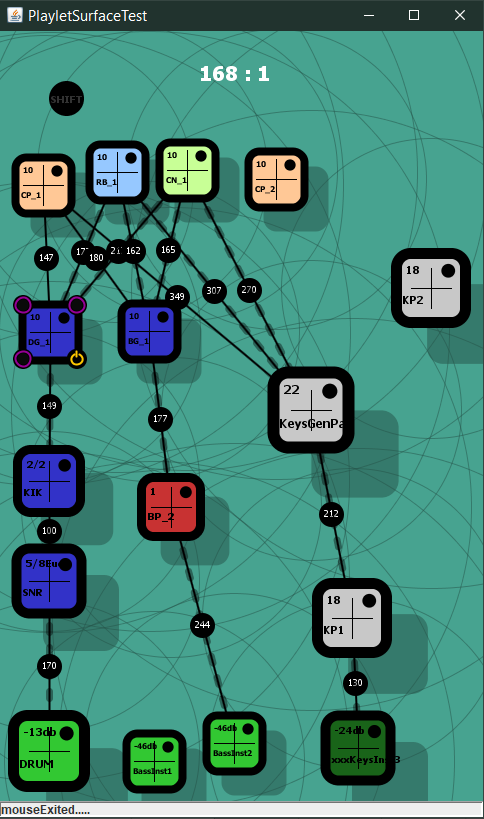

This project from 2015 is an experiment in the combination of a multipart music generation algorithm modelled as a pipeline combined with a graphic representation that links elements in the pipeline based on proximity

Music generation processes are divided up as follows
	
1. Resources - structural information such as chord progressions and accent templates
2. Generators - generate basic instrumental parts
3. Processors - add extra notes or controller informations to a part
4. Output - handles the output of the material to Ableton

- Each process is represented on screen as a rounded square
- Cables attach automatically based on proximity, and the instrumental part to which they belong
- The flow is from top to bottom
- Objects have various switches attached, some of which work.
- Objects can be clicked and dragged
- Using the mouse wheel while mouse overed changes the 'height' of the object above the background, which relates to a parameter
- Resource objects at the top - mouse wheel has no effect
	- CP_1, CP_2 - chord progressions
	- RB_1 - rhythm template
	- CN_1 - contour
	- The actual effect of the above may be confusing. This was more an experiment into the UI and even that was not examined in depth as the interface showed its limitations quite early
- Output objects at the bottom (green) - mouse wheel adjusts track volume in Live
- Generator objects sit in between.
	- for e.g.: mouse over on the KIK object changes the kik pattern, ditto the snare
	- mouse over on the BP_2 object adds/removes embellishment notes on the bass part
	
	
To actually get this to work
- getting the app running requires Java. Actually getting playback requires Ableton Live and Max4Live.
- Open the Live set in the resources folder. There (should be) 5 tracks. The first 4 are instrument tracks, and the 5th contains the UDP Receiver Max patch.
- Check that each instrument track has the PlayletUniversalTrackHeader Max4Live device as the first device in the chain. All instruments used are Ableton instruments.
- Check that track 5 ('PLAYLET') has the DAPlayletUDPReceiver Max patch.
- Run the java app src/ui/DAPlaylet
- Being experimental, and abandoned fairly early on, there is no open ended way of adding gui objects. Press T coninuously and a list of objects will be added.

…. and lastly, being an experiment, these are reflections on the project:

Failures:
	
1. The UI did not seem to be heading in the minimalist direction that I expected. This might have been circumvented by better mockups early in the design process. 
2. In general this project was very informally approached, so design goals and intentions where not clearly articulated early on. I realize in retrospect I was looking for a live performance tool, but what emerged would have been better suited to a personal creative interaction (with a more substantial pallete of options, on a personal computer) or a toy/game (with fewer options, a simplified UI and aimed at a mobile device). Neither of these approaches interested me at the time, so I moved on.
	
Successes:
	
1. I learned some graphics programming in Java.
2. I reused music generation code from a previous project, so even though at this stage I was a beginner in terms of understanding common code conventions, I managed to apply the concept of reusability and extensibility.

